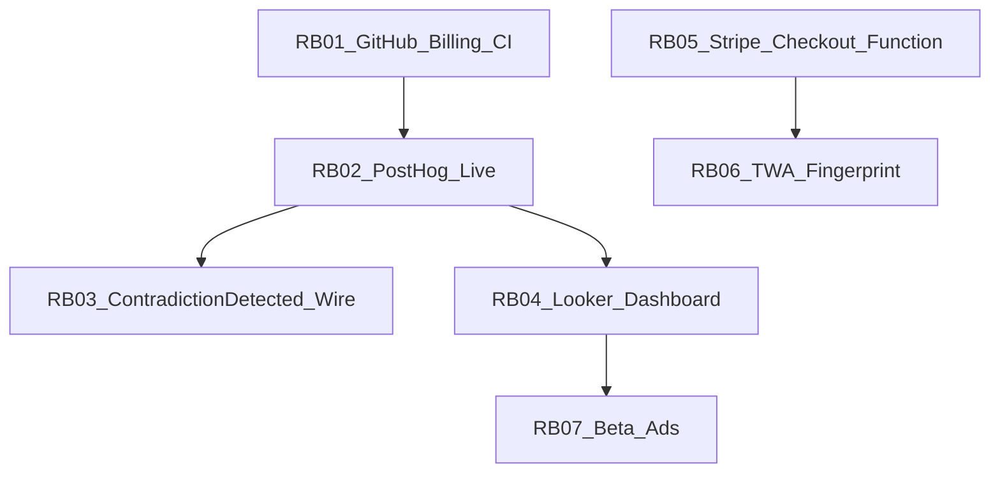

# Remaining backlog — po PROMPT-01..12 (100 %)

Stav kódu na `main` (~`1802e77`): produktový sprint PROMPT-01..12 je **uzatvorený**. Tento dokument je copy-paste backlog pre GitHub Issues / Jira — **nie** zoznam P0 ship blockerov.

**Zámerné rozhodnutia (neotvárať znova):**

- Demo ostáva `activeView: 'map'` (aha = alibi na mape), nie contradictions board
- Graph / Sherlock systémové stringy ostávajú SK v tejto vlne
- Do `assetlinks.json` sa nedáva fake SHA-256 — len fingerprint z reálneho keystore

**Ako použiť:** každý ticket nižšie skopíruj do GitHub Issue. `gh` CLI môže vyžadovať `gh auth login`.

---

## Done vs Remaining

| Oblasť | Stav | Poznámka |
|--------|------|----------|
| Debug HMR / WS probe | Done | HMR na `127.0.0.1`, bez ingestu |
| UTM + LeadCapture + MiniPlayground | Done | `App.jsx`, `HomeHero` |
| Audit `logAction` + AuditLogViewer | Done | upload / paywall / PDF / alibi |
| PostHog 8 helperov + wiring (väčšina) | Done | RB-03: `contradiction_detected` len na demo |
| Onboarding QuickTip / non-blocking intro | Done | |
| PdfExportDialog, bulk ≤20, i18n shell SK/CS | Done | |
| `canCreateCase` + referral credit | Done | |
| TWA scaffolding + PNG + docs | Done | fingerprint = placeholder → RB-06 |
| Stripe test mode + docs | Done | live Checkout → RB-05 |
| Looker / Ads **docs** | Done | live dashboard / spend → RB-04 / RB-07 |
| Lokálny CI (`test`/`lint`/`typecheck`/`build`) | Done | 75/75 |
| `trackContradictionDetected` mimo demo | Done | **RB-03** hotové v useForenzStore.js |
| Stripe `createCheckoutSession` | Done | **RB-05** Base44 serverless function + stripe.js |
| GitHub Actions zelený | Remaining | billing lock → **RB-01** (GitHub admin) |
| PostHog EU prod key | Remaining | **RB-02** (.env / secrets) |
| Looker North Star chart | Remaining | **RB-04** (Looker Studio dashboard) |
| assetlinks SHA-256 z keystore | Remaining | **RB-06** (Google Play signing) |
| Beta 100 + Ads ops | Remaining | **RB-07** (Campaign rollout) |

---

## RB-01 — Unlock GitHub Actions billing + re-run CI

**Title:** `ops: unlock GitHub billing and get CI green on main`

**Why:** Actions job `test-lint-build` končí failure s 0 steps — účet je locked due to billing. Lokálny gate už PASS; bez odomknutia nie je GitHub „zelený“.

**Acceptance:**

- [ ] Billing issue na GitHub účte vyriešený
- [ ] Workflow [`.github/workflows/ci.yml`](../.github/workflows/ci.yml) na `main` prebehne: test → lint → typecheck → build
- [ ] Posledný run na `main` má conclusion `success`

**Owner hint:** Account admin (GitHub Settings → Billing). Dev: po unlock re-run failed workflow alebo prázdny commit.

**Depends on:** nič

---

## RB-02 — PostHog EU live keys

**Title:** `ops: set VITE_POSTHOG_KEY for EU production analytics`

**Why:** Bez kľúča je analytika no-op — North Star (`contradiction_viewed`) sa v cloude nemeria.

**Acceptance:**

- [ ] `VITE_POSTHOG_KEY` (+ `VITE_POSTHOG_HOST=https://eu.i.posthog.com`) v prod / Base44 env
- [ ] Po `demo_launched` alebo uploade viditeľný event v PostHog EU Live
- [ ] Session recording ostáva vypnutá (súlad s [`src/lib/analytics.js`](../src/lib/analytics.js))

**Owner hint:** Product / DevOps. Referencia: [`docs/LOOKER_POSTHOG.md`](LOOKER_POSTHOG.md), [`.env.example`](../.env.example).

**Depends on:** RB-01 voliteľné (nezávislé od CI)

---

## RB-03 — Wire `trackContradictionDetected` on real detection

**Title:** `fix(analytics): fire contradiction_detected outside demo load`

**Why:** `trackContradictionDetected` sa dnes volá len v [`src/store/useForenzStore.js`](../src/store/useForenzStore.js) pri `loadDemoCase`. Reálna detekcia rozporov North Star funnel skresľuje.

**Acceptance:**

- [ ] Po úspešnom `detectContradictions` / store update reálnych rozporov sa volá `trackContradictionDetected(count, hasAlibiConflict)`
- [ ] Demo path ostáva bez dvojitého double-count (alebo je explicitne OK)
- [ ] `npm test` + lint/typecheck PASS; žiadne PII v properties

**Owner hint:** Frontend. Súbory: `useForenzStore.js`, handlery v `ForenzDetectiv.jsx` / contradiction engine callback.

**Depends on:** RB-02 (aby sa event dal overiť v PostHog; kód ide aj bez neho)

---

## RB-04 — Looker Studio North Star chart

**Title:** `ops: Looker Studio WAU contradiction_viewed + funnel`

**Why:** Docs existujú; chýba zdieľateľný dashboard pre Weekly Active Investigators.

**Acceptance:**

- [ ] Looker Studio data source napojený na PostHog EU (alebo BigQuery export)
- [ ] Scorecard: weekly unique users s eventom `contradiction_viewed`
- [ ] Funnel: `demo_launched` → `case_created` → `contradiction_detected` → `contradiction_viewed` → `pdf_exported`
- [ ] Zdieľateľný link (screenshot do repo **nie** povinný)

**Owner hint:** Growth / Analytics. Špec: [`docs/LOOKER_POSTHOG.md`](LOOKER_POSTHOG.md).

**Depends on:** RB-02

---

## RB-05 — Stripe live `createCheckoutSession`

**Title:** `feat(stripe): Base44 createCheckoutSession + live Checkout redirect`

**Why:** [`src/lib/stripe.js`](../src/lib/stripe.js) volá `/api/create-checkout-session` len keď je public key; backend funkcia ešte neexistuje. Bez nej live key padne na chýbajúci endpoint.

**Acceptance:**

- [ ] Nová Base44 function (vzor v [`base44/functions/`](../base44/functions/)) vytvorí Stripe Checkout Session a vráti `{ id }`
- [ ] S `VITE_STRIPE_PUBLIC_KEY` → `redirectToCheckout`
- [ ] Bez kľúča ostáva test mode + banner v PricingModal
- [ ] Aktualizovaný [`docs/STRIPE_SETUP.md`](STRIPE_SETUP.md) (secrets, price IDs)
- [ ] Žiadne falošné live charge v CI

**Owner hint:** Backend + Frontend. Secrets: Stripe secret key v Base44, nie v gite.

**Depends on:** Stripe účet (business). Kód nezávisí od RB-01.

---

## RB-06 — TWA upload-key SHA-256

**Title:** `ops(twa): replace assetlinks placeholder with keystore SHA-256`

**Why:** [`public/.well-known/assetlinks.json`](../public/.well-known/assetlinks.json) má `REPLACE_WITH_UPLOAD_KEY_SHA256`. Play / Digital Asset Links bez fingerprintu neprejde.

**Acceptance:**

- [ ] Keystore / Bubblewrap upload key existuje
- [ ] SHA-256 vložený do `assetlinks.json` (formát `AA:BB:…`)
- [ ] Na produkcii `/.well-known/assetlinks.json` → 200
- [ ] Digital Asset Links verification OK (Chrome / Play)

**Owner hint:** Mobile / Release. Kroky: [`docs/TWA_SETUP.md`](TWA_SETUP.md). PNG ikony a `android/twa-manifest.json` už sú.

**Depends on:** RB-05 nie je tvrdé; prakticky po Play signing. Nezávisí od PostHog.

---

## RB-07 — Beta 100 + Ads ops

**Title:** `ops: segmented beta 100 + SK/CZ Google Ads UTM checklist`

**Why:** Growth mimo kódu — overiť funnel s reálnymi investigátormi a atribúciu cez UTM.

**Acceptance:**

- [ ] Zoznam / segment ~100 beta (LEA, advokáti, investigátori) s invite flow
- [ ] Landing URL s UTM podľa [`docs/GOOGLE_ADS.md`](GOOGLE_ADS.md)
- [ ] Overené: `lead_captured` / `case_created` v PostHog s `utm_source`
- [ ] Kampane SK/CZ checklist (brand + intent + negatives) — **spend a kill-CPI = business rozhodnutie**, nie kódový DoD

**Owner hint:** Founder / Growth. Tech depends: RB-02 (meranie), ideálne RB-04.

**Depends on:** RB-02; odporúčané RB-04

---

## Referencie

| Doc | Účel |
|-----|------|
| [LOOKER_POSTHOG.md](LOOKER_POSTHOG.md) | 8 eventov, North Star, Looker |
| [GOOGLE_ADS.md](GOOGLE_ADS.md) | UTM + kampane SK/CZ |
| [STRIPE_SETUP.md](STRIPE_SETUP.md) | Test vs live Stripe |
| [TWA_SETUP.md](TWA_SETUP.md) | Bubblewrap, assetlinks, Play |
| [todo.md](todo.md) | Historický katalóg PROMPT-01..12 (nemazať / neprepisovať statusy tu) |
